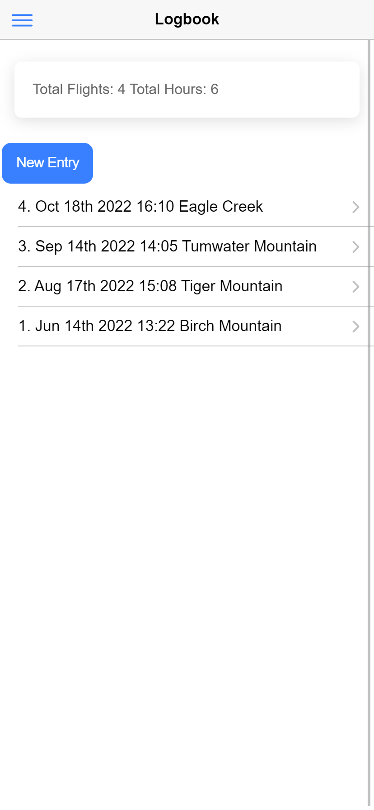

# Paragliding Logbook

This is an app for a paragliding school to store student information and track their progress. Students can enter their profile information, add gliders they fly and then log their flights. New users/students must complete and submit their profile prior to accessing the menu structure and app functionality. The main landing page has a react twitter plugin to make it easy for instructors to post meeting place and time for the next lessons.

Instructors can view students profiles, flights and add comments about students only viewable by other instructors. Comments are visible on the student profile page and can be deleted by the instructor.

Administrators can grant/revoke admin and/or instructor privileges to users. They can also activate/de-activate users. This controls which users are visible on the current student roster in the instructors area.

## What I learned from this project

- Using AWS amplify to build and manage a serverless app
- Using AWS appsync to test and build graphQL queries and mutations to/from dynamoDB
- Using AWS cognito to create and manage user pools
- How to create a cross platform mobile app with the ionic react framework
- Usage and benefits of react useState and useEffect hooks
- The benefits of using a react as a framework compared to vanilla JS
- how to create forms and validate entries with Formik
- Using Redux to manage global state
- Usage of typescript with react
- Using git branches to organize feature additions
- How to use capacitor and android studio to create an android app
- How to use eslint to create consistent code

## How to bootstrap the project

Since the project backend resides on AWS you must have user privileges in the AWS account tied to the amplify project.

- Setup your security credentials in AWS IAM
- Clone the repository
- run `npm install`
- run `amplify pull` and use the credential obtained above
- run `amplify codegen`

## Screenshots

  
    
  Student menu vs user with instructor+admin privileges 

 

  
    
  Instructor and admins areas

 

  
    
  Adding a glider

 

  
    
  Adding a flight log

 

  
    
  Viewing a profile as a student vs the same profile as an instructor

 

    
  Landing page with twitter plugin

 

## Android Build

All of the dev dependencies are in place to and an android version of the app. Android Studio installation is required. To build the android app:

- run `npm run build` to create the production build
- run `npx cap copy android` to copy the production build into the android folders
- run `npx cap open android` to open the project in android studio

## Links

[Logbook app live on AWS](https://logbook.dcbqz0jfj4xyo.amplifyapp.com)

<!-- ## Credits

## License -->
